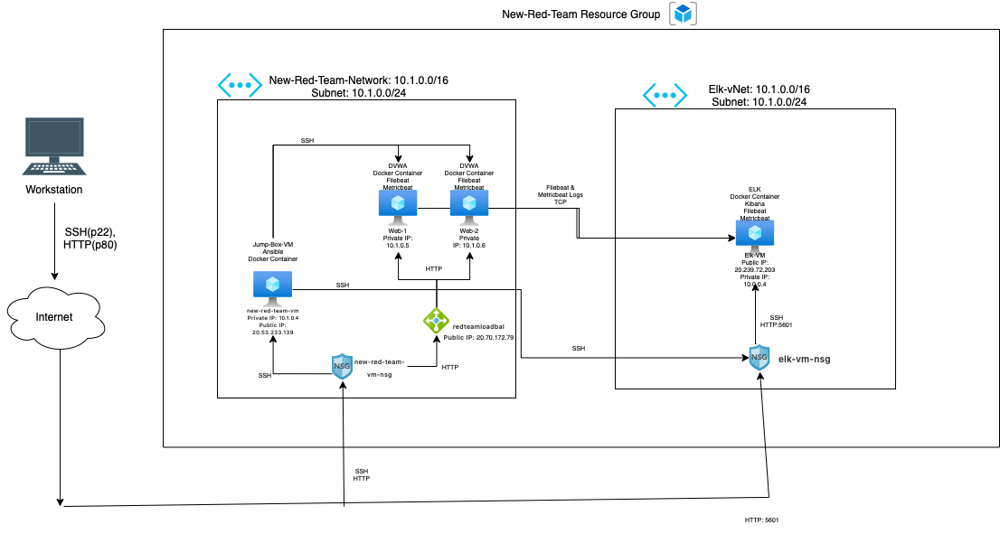
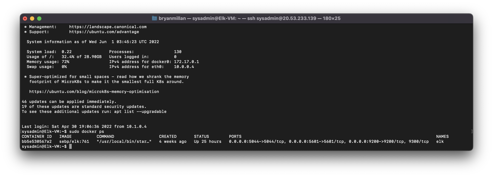

## Automated ELK Stack Deployment

The files in this repository were used to configure the network depicted below.

These files have been tested and used to generate a live ELK deployment on Azure. They can be used to either recreate the entire deployment pictured above. Alternatively, select portions of the playbook file may be used to install only certain pieces of it, such as Filebeat.

  - [pentest.yml](https://github.com/Bryanmillan/Elk-Stack-Project/blob/dcf281101a94b5914b905873237e2488aa2f0459/Ansible/pentest.yml)
  - [install-elk](https://github.com/Bryanmillan/Elk-Stack-Project/blob/dcf281101a94b5914b905873237e2488aa2f0459/Ansible/install-elk.yml)
  - [filebeat-playbook.yml](https://github.com/Bryanmillan/Elk-Stack-Project/blob/dcf281101a94b5914b905873237e2488aa2f0459/Ansible/filebeat-playbook.yml)
  - [metricbeat-playbook.yml](https://github.com/Bryanmillan/Elk-Stack-Project/blob/dcf281101a94b5914b905873237e2488aa2f0459/Ansible/metricbeat-playbook.yml)

This document contains the following details:

- Description of the Topologu
- Access Policies
- ELK Configuration
  - Beats in Use
  - Machines Being Monitored
- How to Use the Ansible Build

### Description of the Topology

The main purpose of this network is to expose a load-balanced and monitored instance of DVWA, the D*mn Vulnerable Web Application.

Load balancing ensures that the application will be highly available and functional, in addition to restricting access to the network.

- What aspect of security do load balancers protect? They mitigate aganist DDos attacks and increase availability.

- What is the advantage of a jump box? It allows for monitoring, logging, and maintenance from a single box. It also allows for remote connections to the network to be handled by one VM.

Integrating an ELK server allows users to easily monitor the vulnerable VMs for changes to the network and system files.

- What does Filebeat watch for? Filebeat watches for log data from the web server, which can be viewed in Kibana

- What does Metricbeat record? Metricbeat records metrics from the OS, which can be viewed in Kibana.

The configuration details of each machine may be found below.
_Note: Use the [Markdown Table Generator](http://www.tablesgenerator.com/markdown_tables) to add/remove values from the table_.

| Name     | Function | IP Address | Operating System |
|----------|----------|------------|------------------|
| Jump Box | Gateway  | 10.1.0.4   |Linux (ubuntu 20.04)            |
| Web-1    |Web Server|      10.1.0.5      |      Linux (ubuntu 20.04)            |
| Web-2    |Web Server|       10.1.0.6     |         Linux (ubuntu 20.04)         |
| Elk-VM|Web Server|    10.0.0.4        |        Linux (ubuntu 20.04)          |

### Access Policies

The machines on the internal network are not exposed to the public Internet. 

Only the Jump Box machine can accept connections from the Internet. Access to this machine is only allowed from the following IP addresses:

- Add whitelisted IP addresses: 76.91.136.37

Machines within the network can only be accessed by Jump Box.

- Which machine did you allow to access your ELK VM? Jump Box
-  What was its IP address? 10.1.0.4

A summary of the access policies in place can be found in the table below.

| Name     | Publicly Accessible | Allowed IP Addresses |
|----------|---------------------|----------------------|
|   Jump Box    | Yes | 76.91.136.37 |
|    Web-1      | No | 10.1.0.4 |
|    Web-2      | No | 10.1.0.4 |
|   Elk-VM      | No | 10.1.0.4 |

### Elk Configuration

Ansible was used to automate configuration of the ELK machine. No configuration was performed manually, which is advantageous because...

* What is the main advantage of automating configuration with Ansible? 
	* Ansible allows you to quicky deploy YAML Playbooks to automate configuration to install multilevel applications.

The playbook implements the following tasks:

* Install docker.io
* Install python3-pip
* Increase Virtual Memory
* Download and Launch ELK Docker Container
* Specify the Published Ports

The following screenshot displays the result of running `docker ps` after successfully configuring the ELK instance.

### Target Machines & Beats
This ELK server is configured to monitor the following machines:

- Web-1: 10.1.0.5
- Web-2: 10.1.0.6

We have installed the following Beats on these machines:

- Filebeat
- Metricbeat

These Beats allow us to collect the following information from each machine:

- Filebeat will be used to collect log files from very specific files such as Apache, Microsft Azure tools and web servers, MySQL databases.
- Metericbeat will be used to monitor VM stats, per CPU core stats, per filesystem stats, memory stats and network stats.

### Using the Playbook
In order to use the playbook, you will need to have an Ansible control node already configured. Assuming you have such a control node provisioned: 

SSH into the control node and follow the steps below:

- Copy the yml file to Ansible folder.
- Update the config file to include remote users and ports.
- Run the playbook, and navigate to http://76.91.136.37:5601/app/kibana to check that the installation worked as expected.

- Which file is the playbook? [filebeat-playbook.yml](https://github.com/Bryanmillan/Elk-Stack-Project/blob/dcf281101a94b5914b905873237e2488aa2f0459/Ansible/filebeat-playbook.yml) & [metricbeat-playbook.yml](https://github.com/Bryanmillan/Elk-Stack-Project/blob/dcf281101a94b5914b905873237e2488aa2f0459/Ansible/metricbeat-playbook.yml)
- Where do you copy it? /etc/ansible/roles
- Which file do you update to make Ansible run the playbook on a specific machine? /etc/ansible/hosts
- How do I specify which machine to install the ELK server on versus which to install Filebeat on? 
	- I have specified two separate groups in the etc/ansible/hosts file. One of the group will be webservers which has the IPs of the 2 VMs that I will install Filebeat to. The other group is named ELKserver which will have the IP of the VM I will install ELK to.
- Which URL do you navigate to in order to check that the ELK server is running? http://76.91.136.37:5601/app/kibana

* As a **Bonus**, provide the specific commands the user will need to run to download the playbook, update the files, etc. 
* Use this command to download playbook: curl -L -O https://artifacts.elastic.co/downloads/beats/filebeat/filebeat-7.7.1-amd64.deb
* Use this command to update the file: nano filebeat-playbook.yml
* Use this command to run the playbook: ansible-playbook filebeat-playbook.yml
